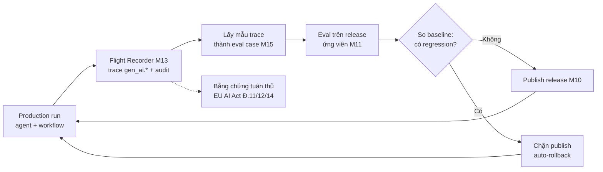

# AgentOS v2 — Roadmap 2026 (M13–M17)

> Tiếp nối `ADVANCED_FEATURES.md` (M10–M12 đã xong: agent releases, evaluation
> gates, tenant quotas). Tài liệu này thay thế mục **"Deferred Candidates"**
> của file đó bằng một lộ trình có căn cứ thị trường.
>
> Đọc `ARCHITECTURE.md` để hiểu kiến trúc. Mỗi milestone có file implement
> chi tiết riêng trong [`tasks/`](tasks/) (`tasks/M<n>-<slug>.md`).
> Mọi quy trình branch/commit/PR theo đúng "Git Workflow & PR Policy" trong
> `IMPLEMENTATION_PLAN.md` — không có ngoại lệ.

Ngày lập: 2026-08-02.

---

## 1. Kết luận cốt lõi

Thị trường 2026 **không thiếu agent thông minh — thiếu agent đáng tin cậy
trong production**. Chỉ 11–12% sáng kiến agent scale được lên production;
Gartner dự báo hơn 40% dự án agentic bị huỷ trước cuối 2027. Rào cản không
còn là năng lực mô hình.

OpenAgent **đã có sẵn gần đủ các mảnh của "platform layer"** mà giới phân
tích gọi là yếu tố khác biệt thật sự: agent releases (M10), evaluations
(M11), quotas (M12), guardrails (M4), sandbox, approval flow, audit log +
OTel (M7). Vấn đề là chúng **rời rạc, không nối thành vòng**.

Trọng tâm roadmap này: nối chúng thành **một vòng lặp độ tin cậy khép kín**
(production trace → eval dataset → quality gate → rollback). Đây là thứ chưa
nền tảng mã nguồn mở nào làm trọn vẹn, và nó tận dụng gần như toàn bộ code
đã viết thay vì xây mới.

---

## 2. Tín hiệu thị trường

| Tín hiệu | Số liệu | Ảnh hưởng tới quyết định |
|---|---|---|
| Tỷ lệ scale lên production | 11–12%; Gartner: >40% dự án huỷ trước cuối 2027 | Ưu tiên độ tin cậy hơn tính năng mới |
| Nguyên nhân lỗi #1 | Thiếu observability + quyền tool quá rộng | M13, M16 |
| Nguyên nhân gốc sự cố đa tầng | **61%** bắt nguồn từ retrieval sai, không phải tool-call | M15 (grader retrieval) |
| Lỗi thầm lặng lớn nhất ở workflow dài | Agent mất task state giữa chừng | M14 |
| Chuẩn liên thông agent | A2A v1.0 (4/2026), Linux Foundation, 150+ tổ chức, có trên AWS/Azure/GCP | M16 |
| Chuẩn observability | OTel GenAI semantic conventions (LLM span, agent span, MCP, events, metrics) | M13 |
| Tuân thủ | EU AI Act rủi ro cao hiệu lực đầy đủ **02/08/2026**: Điều 11/12/14. ISO 42001 map 7 điều | M13, M17 |
| Danh tính agent | RFC 8693 token exchange, claim `act`; nguyên tắc "uỷ quyền thay vì mạo danh" | M16 |
| Nút thắt kỹ thuật mới | Bộ nhớ bền vững, pattern nóng/ấm/lạnh | M17 |

**Nguồn**: Gruve & Sherlocks.ai (agent failure stack), Wority (Gartner),
Zylos Research & arXiv 2505.02279 (A2A/MCP), OpenTelemetry blog (GenAI
conventions), Privacy Pulse & Truvo (EU AI Act ↔ ISO 42001), Red Hat &
Security Boulevard (zero-trust agent identity), Mem0 & AgentMarketCap
(agent memory), Mindra & SketricGen (tiêu chuẩn mua hàng doanh nghiệp).

---

## 3. Khoảng cách so với code hiện tại

Đối chiếu trực tiếp với repo, đã kiểm chứng bằng đọc code (không suy đoán
theo tên file).

### 3.1 Những gì M7 ĐÃ làm (đừng làm lại)

- `agent_loop.py:298` — span `agent_loop.iteration`, attrs `org_id`,
  `agent_id`, `depth`.
- `agent_loop.py:402` — span `tool.call`, attrs `org_id`, `agent_id`,
  `tool_name`, `risk_tier`.
- `agent_loop.py:412` — counter `tool_calls_total{name,status}`.
- `agent_loop.py:414` — `log_action` cho tool `risk_tier=dangerous`.
- `agent_loop.py:543` — counter `agent_run_cost_usd_total{org_id}`.
- `workflow/engine.py:279` — span quanh node run.
- `metrics.py` — 8 metric đã định nghĩa.
- `audit_log` đã wire vào 6 route quản trị: agents, approvals, auth,
  evaluations, orgs, quotas.

### 3.2 Khoảng cách thật

| Nhu cầu | Đang có | Khoảng cách | Milestone |
|---|---|---|---|
| Trace theo chuẩn OTel GenAI | Span tồn tại nhưng dùng attr **tự đặt** (`tool_name`, `org_id`) | Không có `gen_ai.*` nào → span sai hình dạng chuẩn, không cắm được vào LLM view của Datadog/Arize/LangSmith | **M13** |
| Đo token/model trên trace | `agent_run_cost_usd_total` ở mức tổng | **Không có span LLM riêng**; token in/out không nằm trên span nào | **M13** |
| Nhật ký mọi hành động agent (EU AI Act Đ.12) | Chỉ audit tool `dangerous` | Không audit: quyết định guardrail (injection flag, secret redact ở `agent_loop.py:426-428`), approval trong loop, quota denial, tool thường | **M13** |
| Truy vết hành vi ↔ phiên bản cấu hình | `agent_release_id` có trong DB | Không gắn vào span/audit → không biết release nào sinh ra hành vi nào | **M13** |
| Latency tool | `tool_call_duration_seconds` **đã định nghĩa nhưng chưa dùng ở đâu** | Chỉ cần wire | **M13** |
| Giữ state workflow dài, resume | Model `workflow_run`, `workflow_node_run`, `task`, worker arq | Chưa checkpoint từng node, chưa resume, chưa replay → worker chết là mất run | **M14** |
| Chất lượng retrieval đo được | RAG hybrid + rerank; module evaluations riêng | **Hai thứ không nối nhau**: không grader nào đo recall@k / MRR / groundedness | **M15** |
| Liên thông agent (A2A) | MCP client (tầng tool); `call_agent` chỉ nội bộ | Không nói được A2A → không federate được | **M16** |
| Danh tính riêng cho agent | JWT + API key cho *người*, RBAC, risk-tier gate | Agent dùng chung credential org, không truy được "hành động nhân danh ai" | **M16** |
| Context dài hạn | `AgentMemory`, `SessionMemory`, `compactor.py` | Compactor thô: tóm tắt cũ + giữ 4 tin cuối; chưa phân tầng nóng/ấm/lạnh | **M17** |
| SSO doanh nghiệp | JWT + OAuth2/OIDC generic | Chưa SAML, chưa SCIM | **M17** |

---

## 4. Đề xuất trọng tâm: vòng lặp độ tin cậy khép kín

Mũi tên nét đứt: **cùng một dữ liệu trace phục vụ hai mục đích** — cải thiện
chất lượng và hồ sơ tuân thủ. Không phải làm hai lần.

---

## 5. Milestone

| Milestone | Tên | Ước lượng | Phụ thuộc | Đòn bẩy |
|---|---|---|---|---|
| **M13** | Flight Recorder (OTel GenAI + audit runtime đầy đủ) | 2–3 tuần | M7 | Cao nhất — tiền đề cho M14, M15 |
| **M14** | Durable execution & time-travel replay | 3–4 tuần | M13, M6 | Cao |
| **M15** | Khép vòng: trace → eval → cổng chặn | 3–4 tuần | M13, M11, M10 | Cao — điểm khác biệt thật |
| **M16** | Liên thông A2A + danh tính agent | 4–6 tuần | M13, M3 | Chiến lược |
| **M17** | Mở khoá mua hàng doanh nghiệp | Khi có deal | M13 | Bán hàng |

### Merge order

`M13 → M14 → M15 → M16`. M17 tách rời, chỉ khởi động khi có yêu cầu khách
hàng cụ thể.

M14 và M15 **có thể làm song song** sau khi M13 merge (M14 chạm workflow
engine, M15 chạm evaluations — ít đụng file nhau), nhưng nếu 1 người làm
tuần tự thì M15 trước M14 sẽ cho giá trị sớm hơn.

---

## 6. Nguyên tắc sản phẩm (kế thừa M10–M12)

- **Bằng chứng bất biến**: run đã hoàn thành trỏ tới một agent release bất biến.
- **Không mutate production ngầm**: sửa draft không đổi cấu hình đang chạy.
- **Nhân tất định**: quality gate phải chạy được trong CI không cần credential
  của provider.
- **Tenant isolation trước tiên**: mọi bảng mới có `org_id`; mọi truy vấn
  scope theo tenant.
- **Fail có chủ đích**: chính sách khi backend phụ trợ chết phải tường minh.
- **Tương thích ngược**: client chat/agent hiện tại phải chạy suốt quá trình.

Bổ sung cho roadmap này:

- **Chuẩn trước, tự chế sau**: nếu có semantic convention / RFC đã chín
  (OTel GenAI, A2A, RFC 8693) thì theo chuẩn, không tự đặt tên attribute.
- **Một dữ liệu, nhiều mục đích**: trace vừa để debug, vừa để sinh eval case,
  vừa làm bằng chứng tuân thủ.

---

## 7. Đề xuất KHÔNG xây

Quan trọng ngang phần nên xây. Mỗi thứ dưới đây hấp dẫn trên slide nhưng
chưa có dữ liệu cho thấy nó đổi được kết quả.

| Không xây | Lý do |
|---|---|
| Multi-region active-active | Chưa có tải thật để biện minh độ phức tạp. Quay lại khi metrics cho thấy nghẽn thật. |
| Canary traffic splitting theo % | Cần lưu lượng đủ lớn mới có ý nghĩa thống kê. Auto-rollback ở M15 giải quyết phần lớn nhu cầu với một phần nhỏ công sức. |
| Canvas cộng tác thời gian thực | Trình diễn đẹp nhưng không phải lý do khách hàng ký hợp đồng. |
| Tự viết vector DB / LLM gateway | Qdrant + chuẩn OpenAI-compatible đã đủ. Chỗ dễ mất 3 tháng nhất. |
| Marketplace / plugin store riêng | MCP đã đóng vai trò đó. Xây thêm là cạnh tranh với chuẩn đang thắng. |
| LLM-as-a-judge cho mọi eval | Phá vỡ nguyên tắc "nhân tất định". Chỉ thêm như grader tuỳ chọn sau M15. |
